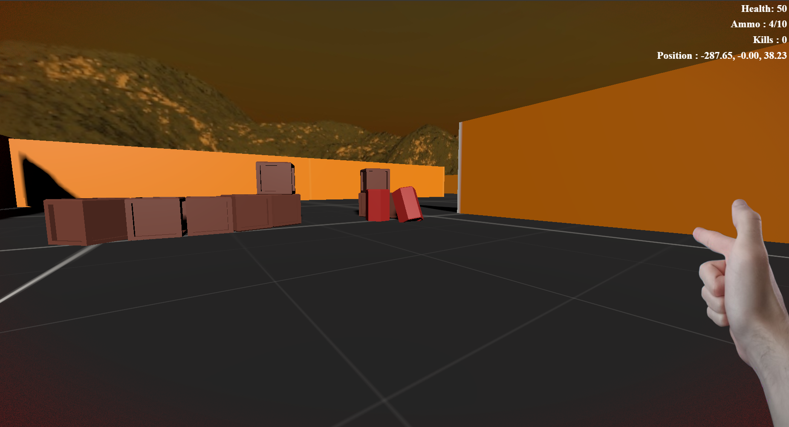
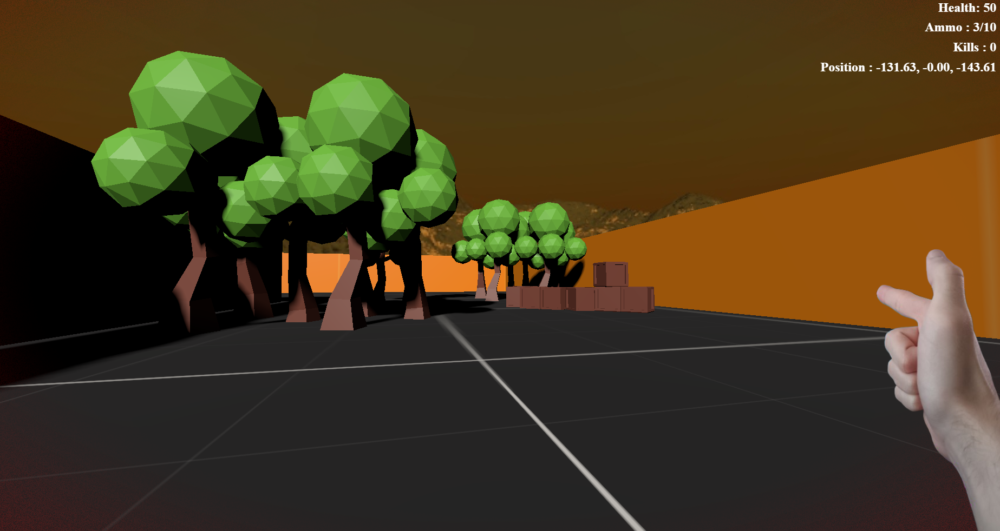
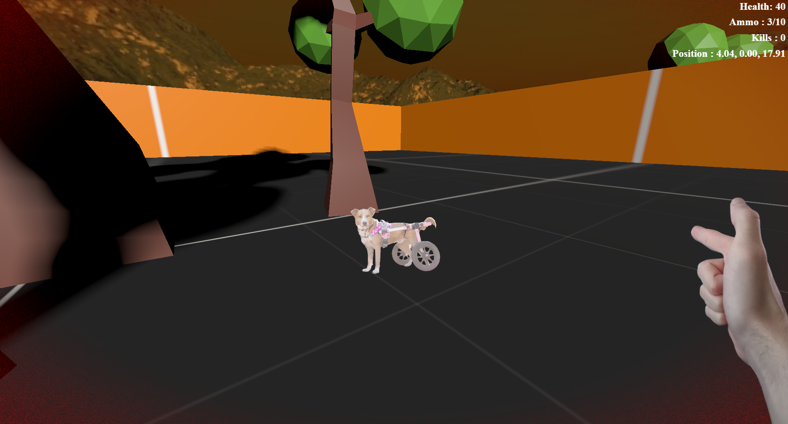

# A small Doom-like made in Javascript and Three.js (Node.js)

This is a small project I made for fun. It's a small 'Doom-like' (Not relly since I'm using 3D while Doom is a 2.5D) where you can move around, shoot and collect loots.  

## Features
- 3D rendering
- First person view (HUD, weapon, etc)
- Shooting and reloading (No damage to enemies yet)
- Loots (Ammo, health, etc)
- Config system
- Simple level design
- Post process shaders (Blood/Health)
- Simple AI (Enemies will follow you and try to kill you) -> Yes there is enemies that shoot at you (And damage you)
- Decals (Bullet holes, blood, etc) -> **Not implemented yet**
- Spawn system (Loot/Enemies) -> **Not implemented yet**

## WARNING WARNING !
YES IT NEEDS OPTIMIZATION !!! + a lot of code improvements

## How to play
- Use the arrow keys to move around (Or `ZQSD` since I'm AZERTY user)
- Press your left mouse button to shoot
- Press `R` to reload the gun
- Use the mouse to look around

## How to run (For now... I'll make a website as soon as I can)
- Clone the repository
- Run `npm install`
- Run `npx vite`
- Open your browser and go to `localhost:5173` (`http://localhost:5173/`)

## Credit/Infos
- This use the [Three.js](https://threejs.org/) library for the 3D rendering
- This use the [Vite](https://vitejs.dev/) bundler
- This use Node.js

## Some screenshots (+ video in screenshots/)

